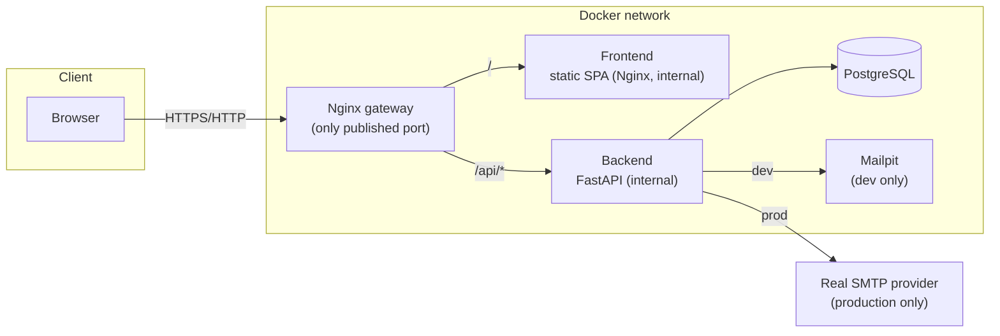

# Architecture

## System overview

## Why this shape

- **One public entry point.** Only the Nginx gateway container publishes a port.
  The frontend and backend are reachable from the gateway over the Docker network,
  never directly from the internet. This keeps CORS simple in production (same
  origin) and centralizes security headers, the CSP, and rate limiting.
- **No Next.js, but still crawlable.** The frontend is a plain Vite/React SPA
  (mandated stack). `frontend/scripts/prerender.mjs` snapshots the important public
  routes into static HTML after `vite build` so crawlers see real content; see
  [seo-strategy.md](seo-strategy.md).
- **Layered backend.** `api/` (FastAPI routers) → `services/` (locale selection,
  business rules) → `repositories/` (SQLAlchemy queries) → `models/`. Each layer has
  a single responsibility, which is what the automated tests target independently
  (repository tests, service-level assertions via the API, and full integration
  tests).
- **No admin panel.** Content is managed through `backend/app/seed/data.py` and the
  idempotent seed script, not a CMS — appropriate for a personal portfolio maintained
  by one person, and avoids a large, mostly-unused feature surface.

## Request flow: a page load

1. Browser requests `/speaking` from the gateway.
2. Gateway proxies to the frontend container, which returns the SPA shell (or, for
   the routes covered by prerendering, real pre-rendered HTML — see
   [seo-strategy.md](seo-strategy.md)).
3. The React app boots, TanStack Query hooks call `/api/v1/events`,
   `/api/v1/events/geojson`, `/api/v1/events/stats`, and `/api/v1/talks` through the
   gateway's `/api/` proxy.
4. The backend resolves the request locale (`lang` query param or
   `Accept-Language` header — see [localization.md](localization.md)), queries
   PostgreSQL through the repository layer, and returns localized JSON.
5. The map (MapLibre GL, lazy-loaded as its own bundle chunk) and the accessible
   event list render from the same data.

## Request flow: the contact form

See [contact-flow.md](contact-flow.md) for the full sequence, including the honeypot,
rate limiting, and email delivery behavior.

## Deliberately excluded

Per the brief, no Kubernetes, no message queue, no microservices, and no bespoke
admin panel — none of these would add real value at this scale, and each would be
another thing to operate, secure, and explain.
