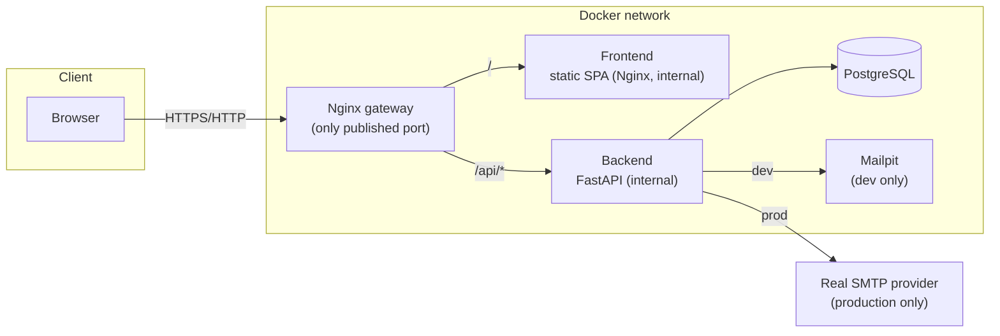

# Architecture

## System overview

## Why this shape

- **One public entry point.** Only the Nginx gateway container publishes a port.
  The frontend and backend are reachable from the gateway over the Docker network,
  never directly from the internet. This keeps CORS simple in production (same
  origin) and centralizes security headers, the CSP, and rate limiting.
- **No Next.js, but still crawlable.** The frontend is a plain Vite/React SPA
  (mandated stack). `frontend/scripts/prerender.mjs` snapshots the important public
  routes into static HTML after `vite build` so crawlers see real content; see
  [seo-strategy.md](seo-strategy.md).
- **Layered backend.** `api/` (FastAPI routers) → `services/` (locale selection,
  business rules) → `repositories/` (SQLAlchemy queries) → `models/`. Each layer has
  a single responsibility, which is what the automated tests target independently
  (repository tests, service-level assertions via the API, and full integration
  tests).
- **Private `/admin` webmaster area.** A CMS is being built out incrementally on top
  of this same backend/frontend (no separate service) — see
  [admin-guide.md](admin-guide.md) once it lands. `backend/app/seed/data.py` remains
  the origin of the initial content and stays useful for bulk/scripted changes and
  fresh-environment seeding; day-to-day edits move to `/admin` as each content
  module ships.

## Request flow: a page load

1. Browser requests `/speaking` from the gateway.
2. Gateway proxies to the frontend container, which returns the SPA shell (or, for
   the routes covered by prerendering, real pre-rendered HTML — see
   [seo-strategy.md](seo-strategy.md)).
3. The React app boots, TanStack Query hooks call `/api/v1/events`,
   `/api/v1/events/geojson`, `/api/v1/events/stats`, and `/api/v1/talks` through the
   gateway's `/api/` proxy.
4. The backend resolves the request locale (`lang` query param or
   `Accept-Language` header — see [localization.md](localization.md)), queries
   PostgreSQL through the repository layer, and returns localized JSON.
5. The map (MapLibre GL, lazy-loaded as its own bundle chunk) and the accessible
   event list render from the same data.

## Request flow: the contact form

See [contact-flow.md](contact-flow.md) for the full sequence, including the honeypot,
rate limiting, and email delivery behavior.

## Request flow: an admin action

1. Browser requests `/admin` from the gateway, which proxies to the same frontend
   container — the admin UI is a lazily-loaded chunk of the same SPA, not a separate
   app (see `frontend/src/admin/`).
2. Every mutating call goes to `/api/v1/admin/*` through the gateway's `/api/`
   proxy, authenticated by a server-side session (`AdminSession`, looked up by the
   SHA-256 hash of an `HttpOnly`/`Secure`/`SameSite=Strict` cookie — never a
   frontend-only guard). A dedicated, stricter Nginx rate-limit zone protects the
   login/2FA-verification endpoints specifically.
3. The backend enforces auth via `get_current_admin_user` in `app/api/deps.py`, then
   the same router → service → repository layering as the public API.
4. Administrative actions are recorded to an `AuditEvent` log; content changes (from
   the Speaking module onward) also snapshot a `Revision` before applying, so
   mistakes are recoverable. See [admin-guide.md](admin-guide.md).

## Deliberately excluded

Per the brief, no Kubernetes, no message queue, no microservices, no third-party
object storage dependency (a pluggable local-filesystem-first storage abstraction is
used instead), and no generic drag-and-drop page builder for the admin area — none of
these would add real value at this scale, and each would be another thing to operate,
secure, and explain.
