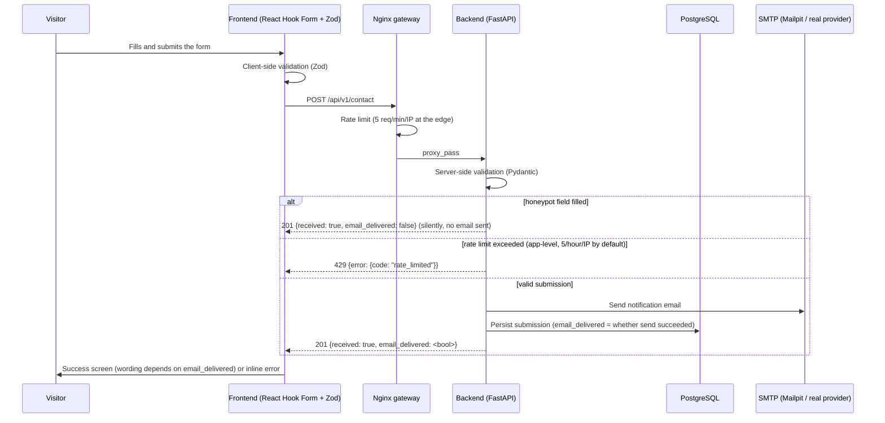

# Contact form flow

## Sequence

## Honesty guarantee

The API **never reports success unless the submission was actually accepted**, and
separately reports whether the notification email actually sent. If SMTP delivery
fails (e.g. Mailpit isn't running, or a production provider rejects the message), the
frontend shows a distinct message: "your message was received, but the email
notification could not be delivered" — never a blanket "message sent" that could be
false. See `ContactForm.tsx` and `ContactService.submit` (`backend/app/services/contact_service.py`).

## Abuse protection layers

1. **Honeypot** — a hidden `website` field. Real users never see it (visually hidden,
   `aria-hidden`, `tabindex="-1"`). Bots that fill it get a fake success response with
   no email sent and no database row written beyond... actually: honeypot
   submissions are accepted and returned as success **without ever calling SMTP or
   persisting to the database**, so an automated scanner cannot distinguish "detected"
   from "delivered."
2. **Application-level rate limiting** — `CONTACT_RATE_LIMIT_PER_HOUR` (default 5)
   per hashed source IP, enforced in `ContactService`. IPs are stored as a SHA-256
   hash (`source_ip_hash`), never in plaintext.
3. **Nginx rate limiting** — the gateway applies a stricter `limit_req` specifically
   on `/api/v1/contact` (5 requests/minute with a small burst), independent of the
   application-level check, so a flood never even reaches FastAPI.
4. **Consent requirement** — `consent_given` must be `true`; enforced by both the
   frontend schema and the backend Pydantic validator.

## What is logged

`ContactService` logs the request type and whether email delivery succeeded — **never**
the message body, name, or email address (see `app/services/contact_service.py`'s
`logger.info(...)` call). This keeps operational logs useful for debugging delivery
issues without duplicating personal data outside the database.

## Local development

Mailpit captures every outgoing email at http://localhost:8025 — nothing is ever sent
to a real address in development, regardless of what email address is entered in the
form.
