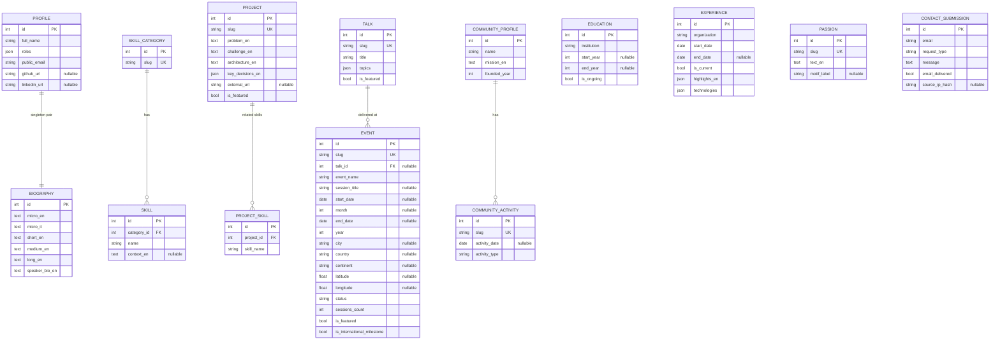

# Data model

Defined in `backend/app/models/`, created by `backend/alembic/versions/0001_initial_schema.py`.

## Design notes

- **Localization without a generic i18n table.** Narrative fields (bios, project
  copy, event descriptions, etc.) use paired `_en` / `_it` columns rather than a
  separate translations table. This is a deliberate trade-off: with only two
  languages and no dynamic language management UI, a generic key-value translation
  table would add a join and a layer of indirection for no real benefit. The
  service layer's `pick(obj, field, locale)` helper (`app/services/localization.py`)
  picks the right column and falls back to English if a translation is genuinely
  missing.
- **Nullable fields for genuinely unknown data.** `Event.start_date`,
  `Education.start_year`, `Event.city/country/latitude/longitude`, and similar
  columns are nullable because several real events in the seed data do not have a
  confirmed exact date or location. Nothing is guessed to fill these in — see
  [event-management.md](event-management.md).
- **`Talk` vs `Event`.** A `Talk` is a reusable session title (e.g. "From Cloud to
  Edge...") that may be delivered at more than one event in principle; `Event` is a
  single engagement, optionally linked to a `Talk` via `talk_id`. Only the three
  talk/event associations confirmed in the product brief are seeded — no other
  session titles are inferred.
- **`ContactSubmission` is never publicly readable.** There is no
  `GET /api/v1/contact` endpoint, by design; see [contact-flow.md](contact-flow.md).
- **`Event.month` alongside `Event.start_date`.** Many real engagements are only
  confirmed to the month ("September 2026"), not an exact day. Rather than guessing a
  day to populate `start_date`, `month` is a separate nullable column set directly (and
  automatically derived from `start_date` when a full date *is* known) — see
  `app/seed/data.py::_event`.
- **`Event.continent` is a curated label, not a geocoded fact.** Kazakhstan and
  Kyrgyzstan are deliberately grouped as `"Central Asia"` rather than `"Asia"`, to
  support this portfolio's speaking-expansion narrative (Europe → North America →
  Central Asia). This is a presentation decision made explicitly per event, not
  derived from country data.
- **`is_international_milestone` vs. `is_featured`.** Two independent booleans on
  `Event`: `is_featured` marks talks with notable session content (surfaced in
  "Featured talks"), while `is_international_milestone` marks a small, curated set of
  appearances that represent a genuine first step into a new country/region (surfaced
  in "International milestones"). An event can be both, either, or neither.
- **Indexes.** Unique indexes on every `slug` column (routing/lookups), plus
  indexes on `Event.start_date`, `Event.year`, `Event.city`, `Event.country`, and
  `Event.continent` to support the speaking page's filters without a full table
  scan.
- **Timestamps.** Every table includes `created_at` / `updated_at` via the shared
  `TimestampMixin` (`app/db/base.py`).
